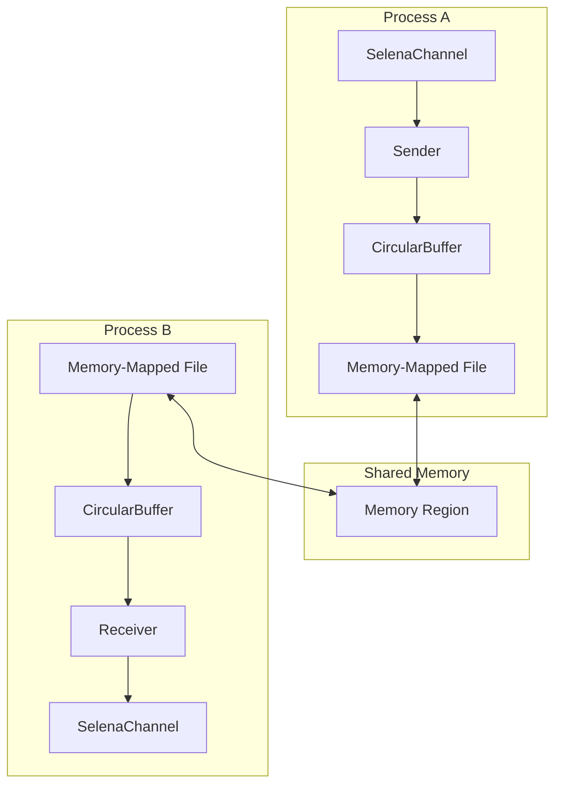

<div align="center">
  
  
  # Selena
  
  **High-Performance Inter-Process Communication for .NET**
  
  [](https://www.nuget.org/packages/Selena/)
  [](https://www.nuget.org/packages/Selena/)
  [](LICENSE)
  [](https://github.com/Taiizor/Selena/actions)
  [](https://codecov.io/gh/Taiizor/Selena)
  
  [Features](#features) • [Getting Started](#getting-started) • [Documentation](#documentation) • [Benchmarks](#benchmarks) • [Contributing](#contributing)
</div>

---

## 🚀 Overview

Selena is a **zero-dependency**, high-performance C# library for inter-process communication (IPC) using Memory-Mapped Files. It enables real-time message exchange between processes with minimal latency and maximum throughput.

### ✨ Key Features

- 🎯 **Zero Dependencies** - Pure C# implementation, no external libraries required
- 🌍 **Cross-Platform** - Works on Windows, Linux, and macOS
- ⚡ **High Performance** - Up to 600+ MB/s throughput with microsecond latency
- 🔒 **Thread-Safe** - Built for concurrent multi-threaded scenarios
- 📦 **Multiple .NET Versions** - Supports .NET 6/7/8 and .NET Standard 2.0/2.1
- 🛡️ **Type-Safe** - Generic message serialization with built-in type safety
- 🔄 **Automatic Recovery** - Handles process crashes and reconnections gracefully
- 📊 **Real-Time Monitoring** - Built-in performance metrics and diagnostics

## 📋 Requirements

- .NET 6.0+ or .NET Standard 2.0/2.1 compatible runtime
- Windows 7+, Linux (kernel 2.6.22+), or macOS 10.12+
- Administrator privileges for Global scope (Windows only)

## 🚀 Getting Started

### Installation

Install via NuGet Package Manager:

```bash
dotnet add package Selena
```

Or via Package Manager Console:

```powershell
Install-Package Selena
```

### Quick Example

```csharp
using Selena.API;

// Create a channel
using var channel = new SelenaChannel("MyChannel");

// Subscribe to messages
channel.MessageReceived += (sender, e) =>
{
    Console.WriteLine($"Received: {e.GetMessageText()}");
};

// Start listening
channel.Start();

// Send a message
await channel.SendMessageAsync("Hello from Selena!");
```

### Advanced Usage

```csharp
// Configure advanced options
var config = new SelenaConfig
{
    ChannelName = "AdvancedChannel",
    BufferSize = 10 * 1024 * 1024,  // 10MB buffer
    OverflowStrategy = OverflowStrategy.Overwrite,
    ScopeMode = ScopeMode.Local,     // No admin required
    PollingInterval = 5,             // 5ms for Linux/macOS
    EnableJsonLogging = true
};

using var channel = new SelenaChannel(config);

// Send typed objects
var order = new Order { Id = 123, Total = 99.99m };
await channel.SendObjectAsync(order, messageType: 1);

// Receive typed objects
channel.MessageReceived += (s, e) =>
{
    if (e.Message.Header.MessageType == 1)
    {
        var receivedOrder = e.GetMessageObject<Order>();
        Console.WriteLine($"Order #{receivedOrder.Id}: ${receivedOrder.Total}");
    }
};
```

## 🏗️ Architecture



## 📊 Performance Benchmarks

Benchmarks performed on Intel Core i7-10700K, 32GB RAM, NVMe SSD:

| Message Size | Messages/sec | Throughput | Latency (μs) |
|-------------|--------------|------------|--------------|
| 64 bytes    | 1,200,000+   | 73 MB/s    | < 1          |
| 1 KB        | 680,000+     | 664 MB/s   | 1-2          |
| 4 KB        | 170,000+     | 665 MB/s   | 5-6          |
| 16 KB       | 42,000+      | 656 MB/s   | 20-25        |

### Comparison with Other IPC Methods

| Method          | Throughput | Latency | CPU Usage |
|-----------------|------------|---------|-----------|
| **Selena**      | 600+ MB/s  | < 25μs  | Low       |
| Named Pipes     | 200 MB/s   | 50μs    | Medium    |
| TCP Loopback    | 300 MB/s   | 100μs   | High      |
| gRPC (local)    | 150 MB/s   | 200μs   | High      |

## 🛠️ Configuration Options

| Option | Description | Default | Notes |
|--------|-------------|---------|-------|
| `ChannelName` | Unique channel identifier | Required | Must be unique per channel |
| `BufferSize` | Shared memory size | 1 MB | Minimum 1 KB |
| `OverflowStrategy` | Buffer full behavior | Overwrite | Overwrite or Block |
| `ScopeMode` | Windows IPC scope | Local | Local (user) or Global (system) |
| `PollingInterval` | Unix polling interval | 10 ms | Lower = more responsive |
| `MaxWaitTime` | Operation timeout | 5000 ms | For blocking operations |

## 📚 Examples

Check out the [examples](examples/) directory for complete samples:

| Example | Description | Run Command |
|---------|-------------|-------------|
| **[Simple](examples/Selena.Examples.Simple/)** | Basic send/receive | `dotnet run --project examples/Selena.Examples.Simple` |
| **[Chat](examples/Selena.Examples.Chat/)** | Multi-process chat | `dotnet run --project examples/Selena.Examples.Chat -- Alice` |
| **[Benchmark](examples/Selena.Examples.Benchmark/)** | Throughput testing | `dotnet run --project examples/Selena.Examples.Benchmark` |
| **[Object](examples/Selena.Examples.Object/)** | Type-safe messaging | `dotnet run --project examples/Selena.Examples.Object` |
| **[Stress](examples/Selena.Examples.Stress/)** | High-load scenarios | `dotnet run --project examples/Selena.Examples.Stress` |

## 🤝 Contributing

We welcome contributions! Please see our [Contributing Guide](CONTRIBUTING.md) for details.

### Development Setup

1. Clone the repository
```bash
git clone https://github.com/Taiizor/Selena.git
cd Selena
```

2. Build the project
```bash
dotnet build
```

3. Run tests
```bash
dotnet test
```

4. Run benchmarks
```bash
dotnet run -c Release --project tests/Selena.Benchmarks
```

## 📝 Documentation

- [API Reference](docs/API.md)
- [Architecture Overview](docs/Architecture.md)
- [Performance Tuning](docs/Performance.md)
- [Troubleshooting](docs/Troubleshooting.md)
- [Migration Guide](docs/Migration.md)

## 🛣️ Roadmap

- [ ] Named pipe fallback for unsupported systems
- [ ] Compression support for large messages
- [ ] Encryption for sensitive data
- [ ] Distributed tracing integration
- [ ] Unity/Godot engine support
- [ ] Web Assembly (WASM) compatibility

## 📄 License

This project is licensed under the MIT License - see the [LICENSE](LICENSE) file for details.

## 🙏 Acknowledgments

- Inspired by various IPC libraries across different platforms
- Thanks to all contributors who have helped shape Selena
- Special thanks to the .NET community for feedback and support

## 📞 Support

- 🐛 Issues: [GitHub Issues](https://github.com/Taiizor/Selena/issues)
- 📖 Wiki: [GitHub Wiki](https://github.com/Taiizor/Selena/wiki)
- 💬 Discussions: [GitHub Discussions](https://github.com/Taiizor/Selena/discussions)

---

<div align="center">
  Made with ❤️ by the Selena Community
</div>